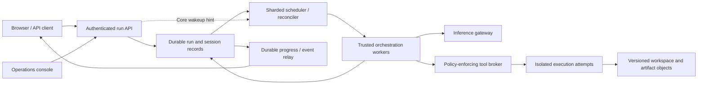

# Durable agent execution and persistent environments

Status: architecture proposal and isolated lifecycle experiment, September 5, 2026.
No live chat behavior changes in this branch. Capacity figures are design inputs,
not measured throughput or an availability claim.

## Product contract

A user starts a task, closes the browser, and returns later to its progress and
result. The agent's next turn sees its committed files, tools, package versions,
and environment configuration. Worker replacement does not lose acknowledged
work. An operator can inspect, pause, cancel, drain, quarantine, and recover runs.

NATS Core is the only NATS transport. JetStream is excluded. Durable correctness
must not depend on delivery of a notification or an open subscription.

The first-class objects are:

- **Session:** tenant/account, user, agent/project, access policy, ordered turns,
  long-term history, active-run pointer, and committed environment generation.
- **Run:** one submitted task/turn, request idempotency key, execution grant,
  deadline, budgets, state, step ledger, child-run tree, and output references.
- **Workspace:** versioned files and installed tools, pinned image/runtime and
  package manifests. A session can retain it while no compute is allocated.
- **Attempt:** replaceable worker/sandbox with a lease epoch, private writable
  scratch, and a starting checkpoint. An attempt is not a session.

Browser disconnect detaches an observer. Explicit Stop cancels a run. Logout,
permission revocation, credential expiry, and policy changes have deliberate
execution-grant semantics independent of the HTTP connection.

## What exists today

Code and AWS inspection confirmed:

- Both web bridges cancel agent execution when their SSE reader disconnects.
- nats-agent owns active runs in process memory. Its stream protocol includes
  run IDs and sequence numbers, but does not provide durable event replay.
- Copay mounts encrypted EFS with an access point at /workspaces; session files
  and node_modules can survive turns and task replacement. Its janitor currently
  removes workspaces after 30 days of inactivity.
- RedSail uses S3 workspace archives; node_modules and module caches are excluded.
  Workspace objects have a 30-day expiry. Durable drive blobs are separate.
- RedSail's Terraform defines independent regional DynamoDB session tables,
  not a globally coherent execution store. Browser/load-balancer stickiness is
  not an ownership or recovery mechanism.
- Deno executes inside the application task today. That is not the isolation
  boundary for the proposed multi-tenant tool-installation platform.

These are migration inputs, not guarantees to carry into the new platform.

## Capacity envelope

Plan for 1 million turns/day initially and 10 million/day as a growth envelope.
Model-call counts, code-use fraction, duration distribution, workspace sizes,
and customer bursts must be measured in Development before sizing Production.

| Assumption | 1M turns/day | 10M turns/day |
|---|---:|---:|
| Average arrivals/sec | 11.6 | 115.7 |
| Active runs at 120-second average duration | 1,389 | 13,889 |
| Arrivals/sec at 10x sustained burst | 116 | 1,157 |
| Active runs during that burst, same duration | 13,889 | 138,889 |
| Sandbox concurrency if 20% use code for 20 seconds | 46 | 463 |
| Same sandbox scenario at 10x burst | 463 | 4,630 |

This is Little's-law arithmetic, not a benchmark. Code-use estimates are explicit
placeholders. Model-provider tokens/minute, database capacity, outbound tool
quotas, package registry bandwidth, image launch latency, storage throughput,
and regional recovery capacity can dominate before CPU does.

Read-only AWS quota inspection on September 5 found **4,000 on-demand Fargate
vCPUs, 20 sustained task launches/second, and 100 burst launches** per region in
Production (us-east-1 and us-west-2). These are account quotas shared with existing
applications, not available capacity reserved for agents. Do not assume they can
absorb the growth/burst envelope. Warm sandbox reuse, quota planning, subnet/IP
capacity, image distribution, and reserved failover headroom need load validation.

A container per entire turn is the wrong allocation unit for these assumptions.
Trusted orchestration workers multiplex bounded asynchronous model/tool waits.
Allocate an isolated sandbox when execution needs it; retain it warm for a short
bounded session interval, then reclaim compute while preserving committed state.
Never reuse a dirty sandbox for another tenant.

## Regional cells and the data path

Use bounded regional cells so a noisy tenant, bad agent release, or storage hot
partition affects a subset of traffic. Each cell has admission/API nodes,
schedulers, trusted workers, stream relays, sandbox capacity, and storage shards.
A directory maps each session to its cell and authoritative region.

1. Authenticate and authorize admission; check tenant/agent quotas and queue
   bounds. Atomically write request deduplication, run record, session ordering,
   and a durable ready record before returning accepted/runId.
2. Publish a best-effort NATS Core wakeup hint. Failure after acceptance changes
   latency only. A reconciler queries persisted ready shards so lost hints and
   worker crashes cannot strand work.
3. Schedule fairly across tenants and task classes. Use weighted shares,
   concurrency caps, interactive/background lanes, aging, and bounded backlog.
   A session has one writable turn at a time; additional turns queue explicitly.
4. Claim via conditional state transition; issue an epoch/fencing token and a
   bounded lease. Heartbeats renew leases. Every state publication compares the
   run/attempt epoch. A stale worker cannot advance durable state.
5. Checkpoint each model result/tool intent/tool result and workspace commit.
   Persist the full structured conversation including tool IDs, not just final
   assistant text. Pin the agent/model/tool configuration used by the run.
6. Store durable progress in ordered batches. NATS Core fans out notifications;
   relays serve replay from storage. Persisted sequence/cursor plus gap detection
   handles reconnects and snapshot-to-live races. Do not write every token to
   DynamoDB or leave results dependent on a subscriber's inbox subject.
7. Commit terminal result, release session ownership, and enqueue the next turn.
   Repeated completion/cancel callbacks must be idempotent.

Proposed additive protocol: `runs.submit` returns a durable runId;
`runs.get` returns authoritative state; `runs.events(afterSequence)` returns
persisted event batches; `runs.control` requests cancel/pause/resume. Authenticated
SSE endpoints expose observation/replay to browsers. Every endpoint enforces
verified tenant/user scope through the same deterministic Identity layer as
chat. A wakeup notification is never accepted as authority to run a payload.
Legacy chat remains available while clients migrate; detach semantics are
explicitly advertised as a capability rather than silently changed globally.

Production schema separates small run/session metadata, request dedupe records,
step records, ready/lease index entries, and chunked event/artifact objects.
Partition ready work by cell, lane, hash shard, and time bucket; never use one
'QUEUED' partition, scan all sessions, or poll every run continuously. Treat an
eventually consistent ready index as discovery only; the conditional claim is
authoritative. Workers renew/checkpoint in bounded batches where safe.

Avoid one global quota counter. Allocate conservative budget shares by region/
cell; tenant counters and grants enforce the allocated limits. Admission and
scheduling return backpressure when queues, provider quotas, or capacity are
exhausted. Autoscaling uses queue age, ready depth, active leases, and provider
capacity, not CPU alone.

## Checkpoints, retries, and side effects

The platform promises durable acceptance and recovery of committed progress,
not exactly-once external side effects or resumption of CPU instructions.

Write a step intent with a stable idempotency key before dispatch. Store the
completed output and its matching workspace snapshot references atomically.
A lost worker with only an intent recorded creates an unknown outcome:

- If the target accepts idempotency keys, retry/reconcile with that same key.
- If the action is known safe to replay (e.g. a read), its adapter may opt in.
- Otherwise pause as `needs_reconciliation`; do not repeat a payment, message,
  mutation, or expensive opaque operation automatically.

A database fence alone does not stop an old process writing EFS or calling a
remote service. Attempts therefore write separate workspace generations, and
the tool broker independently checks epoch, execution grant, and budget before
dispatch. Gateways must refuse superseded epochs. External in-flight actions
still require target-side idempotency/reconciliation. On lost lease, kill or
quarantine the sandbox; never let two attempts write the same committed drive.

## Persistent environment and tool installation

Default capability target: Deno/Node JavaScript, Python, user-space CLI tools,
files, and managed tool calls. The original question about language priority is
still open; it does not change the persistence/control-plane design.

A session environment manifest pins:

- OCI base image digest, CPU architecture, runtime versions, UID/GID, and paths;
- exact dependency lockfiles, installed-tool versions and content hashes;
- retained package artifacts or reusable immutable dependency layers;
- workspace manifest, file/blob hashes, generation, and snapshot parent;
- the tool catalog/policy version. Credentials are never part of the snapshot.

Locks alone do not guarantee rebuilds if upstream packages disappear. Retain the
approved package artifacts. Installation goes through a package broker/mirror,
with network policy, size/runtime limits, provenance, and immutable versioning.
Packages install into the session's user prefix/venv; OS-level additions require
a new managed base image. Verify a new environment in a fresh sandbox before
committing it. Keep prior generations for recovery; upgrade explicitly, never
silently follow mutable image tags or dependency ranges.

Use local scratch for hot execution; persist incremental, content-addressed
workspace objects/manifests to S3. EFS can provide a regional working set/cache
where measurements justify it, but it is not a globally shared mutable home.
Avoid full-workspace tar uploads after every tool call. Preserve supported
filesystem semantics (including executable bits and safe symlinks) deliberately.
An upload is committed only after all referenced objects are durable and
verified. Partial uploads remain unreferenced and can be garbage-collected.

A warm sandbox may keep interpreter state briefly, but the durable contract is
files, installed tools, and explicit checkpoints. Python variables, open DB
connections, child processes, and arbitrary in-memory state do not survive a
worker/region replacement. A failed long script resumes from its own explicit
checkpoint or restarts according to its replay policy.

Separate conversation, workspace, cache, artifact, and audit retention. Proposed
workspace policy: retain while the session/project is retained, subject to tenant
storage budgets and an explicit archive/delete policy. No silent 30-day deletion
of an environment the product promises to keep. Quiesce/fence before deletion;
never delete active work because an activity timestamp happened to be stale.

## Containment of faulty or rogue agents

Run model-generated code in a distinct isolation boundary from the trusted
scheduler, inference client, and credential-bearing tool broker. Fargate tasks
provide a documented hardware-virtualized isolation boundary; a second container
in the same task or a subprocess in the web service is insufficient for this
platform's cross-tenant execution model.

- No application database credentials, broad AWS role, raw NATS credentials,
  Docker socket, host mounts, or ability to provision more workers in a sandbox.
- Explicit per-run tool capabilities, tenant/account scope, egress policy, and
  short-lived worker credentials. Network control is outside the agent process.
- CPU, memory, wall-clock, process count, disk bytes/inodes, upload/output, model
  tokens, tool calls, child-run fan-out/depth, and monetary budget limits.
- A supervisor outside the sandbox enforces limits, renews leases, and kills
  the entire task/process tree when required. An agent cannot extend its own
  limits by changing a prompt or environment variable.
- Quarantine a workspace/tool/image/version after repeated violations; preserve
  bounded evidence and prevent automatic restart loops. Terminate malicious
  package installers under the same boundary as model code.
- Deterministic authorization at the broker and target tools. Model instructions
  and filesystem paths are not access-control mechanisms.

An execution grant is minted by Identity for the run, bound to user, account,
agent, capabilities, policy version, budget, and expiry. It can outlive browser
presence within policy. Revocation and permission changes remain enforceable.
Do not keep refreshing a browser IDT indefinitely or replace it with a service
administrator credential. Identity integration is a release dependency.

## Availability and regional failover

Use at least two AZs per cell, independent worker pools, durable stores, and
reconcilers. A cell outage routes NEW work to healthy cells within reserved
capacity. Existing sessions recover only after ownership and data are reconciled.

The current East/West stores cannot independently claim the same run. DynamoDB
conditional writes on eventual global-table replicas do not provide a global
lock. Initial implementation uses an authoritative home region per session.

For regional recovery, evaluate a small MRSC control directory with replicas in
us-east-1/us-west-2 and a witness in us-east-2, plus regional transactional run
stores. This is new proposed infrastructure, not assumed to exist. MRSC does not
support transactions; it must not be substituted blindly for the regional
transactional store. Promotion requires an authority epoch, old-cell fencing,
and a recoverable checkpoint whose referenced artifacts exist in the destination.
If old writers cannot be fenced, do not permit unsafe automatic replay.

EFS replication is asynchronous (AWS documents a 15-minute RPO for most file
systems), and S3 cross-region replication is also not synchronous. Neither
establishes zero-loss workspace failover. For a zero-loss committed checkpoint
contract, explicitly write/verify required immutable objects in both regions
before publishing a globally recoverable checkpoint; measure latency/cost and
specify availability when the second region is unavailable. Keep regional
progress separate from the last globally recoverable checkpoint.

Availability, RTO, and RPO must be separate targets for accepted requests,
checkpointed outputs, and uncommitted sandbox changes. We cannot promise no lost
in-memory computation or zero downtime for every network partition.

## Operator experience

A shared execution console/API, available from RedSail administration, should
provide:

- Runs by tenant, agent, user, state, age, region, worker, and model/tool version;
  queue position, current step, progress, artifacts, spend, and limits.
- Cancel now; pause at next checkpoint; resume; reconcile an uncertain step;
  retry as a linked new run; drain a worker/cell; disable an agent/tool/version;
  tenant throttling and emergency kill switches.
- Audit actor/reason for each command; authorization separate from task
  execution rights; no token/PHI dumps into unrestricted operator logs.
- Fleet metrics: accepted-to-start latency, oldest queue age, active/orphaned
  leases, recovery time, duplicate dispatches, uncertain outcomes, provider
  throttling, cost, workspace bytes, sandbox starts, and limit violations.
- Persisted cancellation/pausing controls. NATS notifications accelerate them;
  workers/supervisors poll durable state so an offline subscription cannot
  defeat an operator command. Clearly distinguish requested vs confirmed stop.

## Delivery and evidence gates

1. **Architecture/lifecycle proof (this branch):** isolated DynamoDB CAS experiment
   and deterministic failure tests. No production endpoints or scheduling claims.
2. **Shared durable run API:** admission, scoped identity grants, request ledger,
   session ordering, ready shards, worker leases, explicit cancel, durable event
   replay, and browser reattachment. Migrate one agent behind a feature flag.
3. **Persistent isolated workspaces:** sandbox allocator/supervisor, immutable
   manifest and package artifacts, brokered tools, workspace migrations, retention,
   resource limits. Preserve ordinary SQL tool routing for simple questions.
4. **Management and recovery:** operator console, quotas, pause/drain/quarantine,
   unknown-outcome reconciliation, deployment-safe checkpoints, and audit trail.
5. **Scale and regional proof:** sustained load and chaos tests, quota increases,
   provider capacity, cell isolation, failover exercises, cost model, and explicit
   measured SLO/RTO/RPO. Only then make a millions-of-turns capacity claim.

Acceptance tests include: close/reopen browser; restart bridge; kill worker
before/after acceptance, tool dispatch, object upload, and checkpoint commit;
lose all Core notifications; run competing claimants; expire/revoke grants;
exhaust tenant quota; kill runaway code; interrupt package installation; resume
next turn in a fresh sandbox with the same pinned packages/files; test a region
partition without dual publication or blind replay of external effects.

## Sources

- [Fargate isolation](https://docs.aws.amazon.com/AmazonECS/latest/developerguide/security-shared-model.html)
- [ECS/Fargate quotas](https://docs.aws.amazon.com/general/latest/gr/ecs-service.html)
- [Fargate launch throttling](https://docs.aws.amazon.com/AmazonECS/latest/developerguide/throttling.html)
- [DynamoDB global-table consistency and transaction limits](https://docs.aws.amazon.com/amazondynamodb/latest/developerguide/globaltables-CoreConcepts.html)
- [MRSC region choices and creation](https://docs.aws.amazon.com/us_en/amazondynamodb/latest/developerguide/V2globaltables.tutorial.html)
- [EFS replication](https://docs.aws.amazon.com/efs/latest/ug/efs-replication.html)
- [Lambda durable execution](https://docs.aws.amazon.com/lambda/latest/dg/durable-basic-concepts.html)

Lambda can host bounded adapter steps. Moving the existing Go model loop to a
single ordinary Lambda invocation does not provide this platform. Durable
Functions or Step Functions remain alternatives to evaluate for orchestration,
but neither supplies persistent sandbox environments, tool governance, fair
multi-tenant scheduling, or the product's operator controls by itself.
